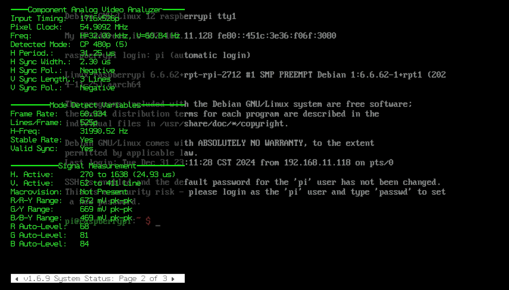
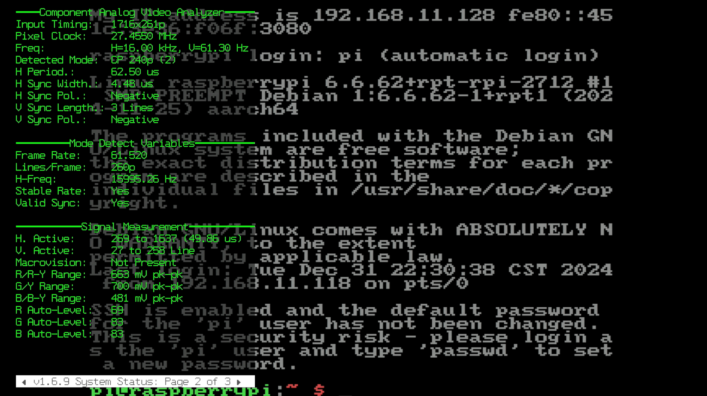
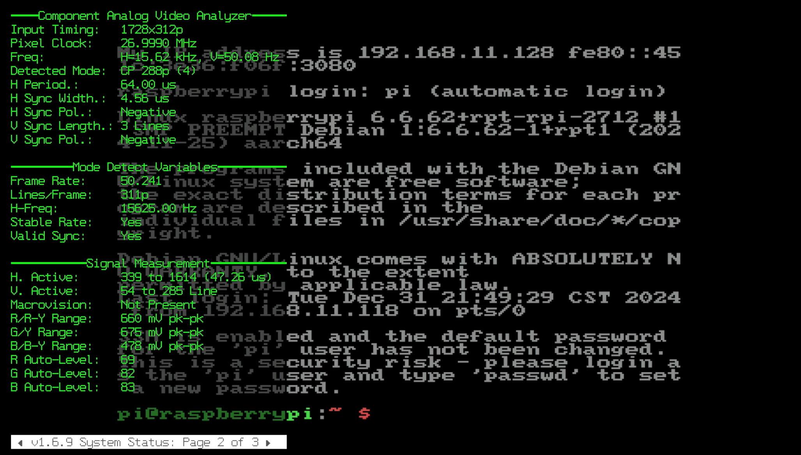
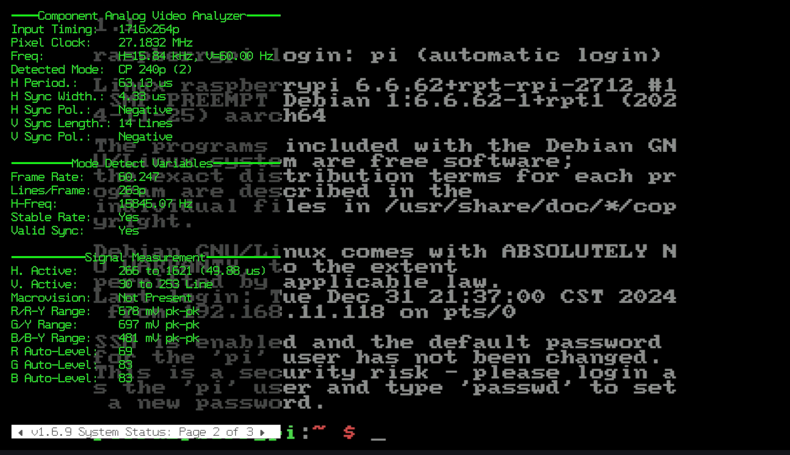

# Working config for RGR VGA666RGBS Adapter
---
# Before PiOS Bookworm

Add blow lines at the end of config.txt on the SD card for your Raspberry Pi

```
dtoverlay=vga666
enable_dpi_lcd=1
display_default_lcd=1
dpi_group=2

#for CRT
dpi_mode=87
#hdmi_timings=320 1 20 29 35 224 1 10 14 16 0 0 0 60 0 6400000 1 # 320:224 Sega Genesis (NTSC)
#hdmi_timings 450 1 50 30 85 288 1 10 1 25 0 0 0 60 0 9600000 1 # works
#hdmi_timings=480 1 40 20 75 270 1 10 10 22 0 0 0 50 0 9600000 1 # works
#hdmi_timings=480 1 14 45 56 300 1 10 5 5 0 0 0 60 0 9600000 1 # works 480x300
#hdmi_timings 480 1 24 45 75 270 1 10 10 8 0 0 0 50 0 9600000 1 # works
#hdmi_timings=256 1 8 17 21 224 1 7 10 24 0 0 0 60 0 4800000 1 # 256:224 NES, SNES (NTSC)
hdmi_timings=320 1 16 30 34 240 1 2 3 22 0 0 0 60 0 6400000 1 #240p
```

just pick one line starting with hdmi_timings above with prefer resolution setting and remove the # to enable it. Starting with # means the whole setting line is disabled as comment

---

# PiOS Bookworm and later

Add blow lines at the end of config.txt on the SD card for your Raspberry Pi
```
dtoverlay=vc4-kms-dpi-generic
dtparam=bgr666-padhi=1
dtparam=hsync-invert,vsync-invert
```

then pick one of these settings and add it right under previous above lines.


**For 480P**
```
dtparam=clock-frequency=25600000
dtparam=hactive=640,hfp=32,hsync=60,hbp=68
dtparam=vactive=480,vfp=2,vsync=3,vbp=41
```


**Generic 240 @ 60Hz**
```
dtparam=clock-frequency=6400000
dtparam=hactive=320,hfp=16,hsync=30,hbp=34
dtparam=vactive=240,vfp=2,vsync=3,vbp=16
```


**Generic 240 @ 50Hz**
```
dtparam=clock-frequency=6750000
dtparam=hactive=320,hfp=26,hsync=32,hbp=54
dtparam=vactive=240,vfp=26,vsync=3,vbp=43
```



**320:224 Sega Genesis (NTSC)**
```
dtparam=clock-frequency=6400000
dtparam=hactive=320,hfp=20,hsync=29,hbp=35
dtparam=vactive=224,vfp=10,vsync=14,vbp=16
```



